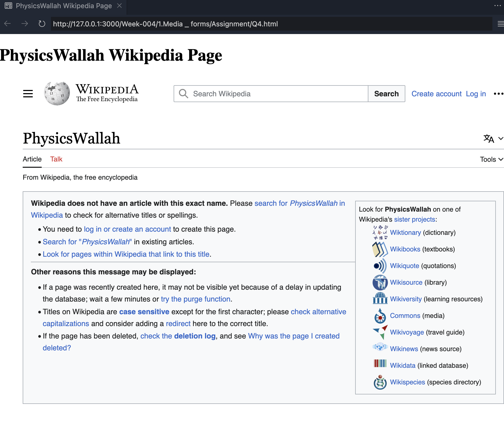

## Question 1: Create an image gallery that holds multiple images.

## Question 2: Use video and audio tags to display video and audio with the playback, audio controls.

## Question 3: Modify the previous assignment so that the audio and video play automatically as the page is loaded and they should play infinitely

## Question 4: Use iframe to embed the PhysicsWallah Wikipedia page properly.

## Question 5: Create a sign-up and sign-in form with proper validation a. Sign up form should have a first name, last name, email, password, confirm password, age, gender,and agree to terms and conditions fields at minimum b. Sign in form should have email, password fields NOTE: Validation is a must Ex: First name, last name, email cannot be less than 3 characters, age cannot be negative and cannot be greater than 150, fields are required, etc..

