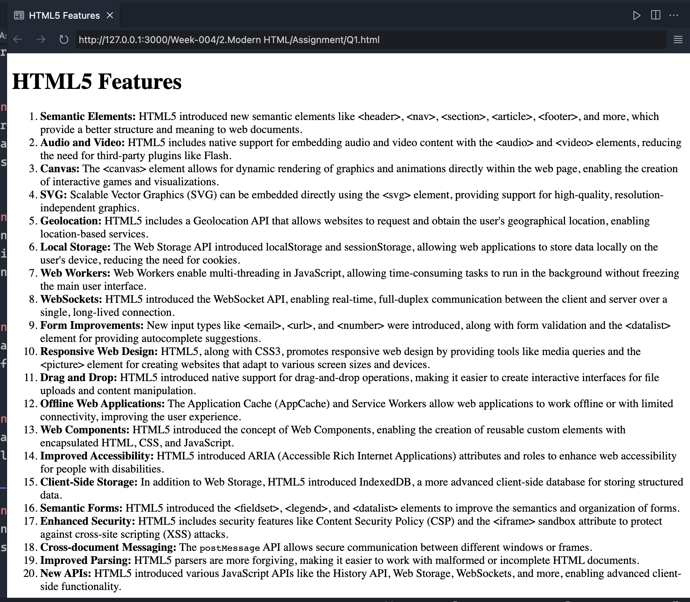
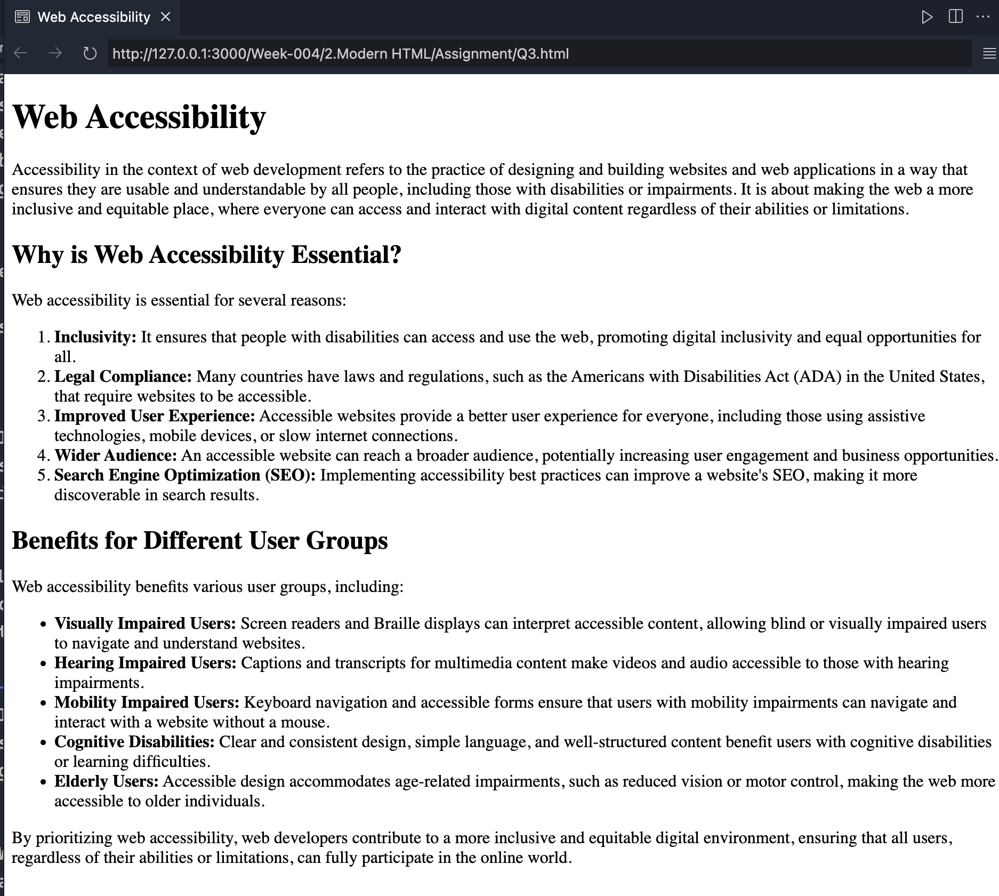
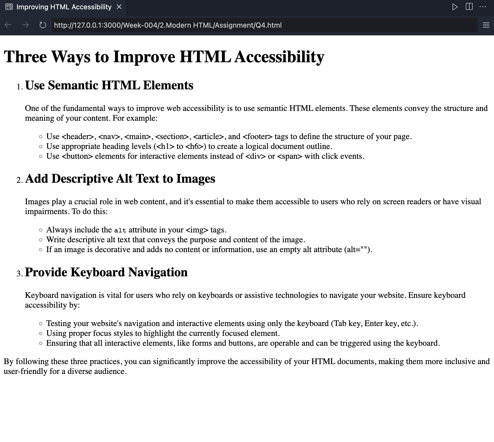
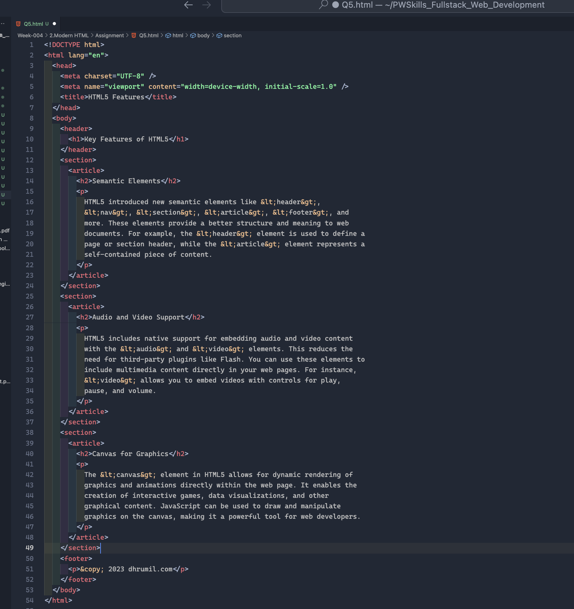
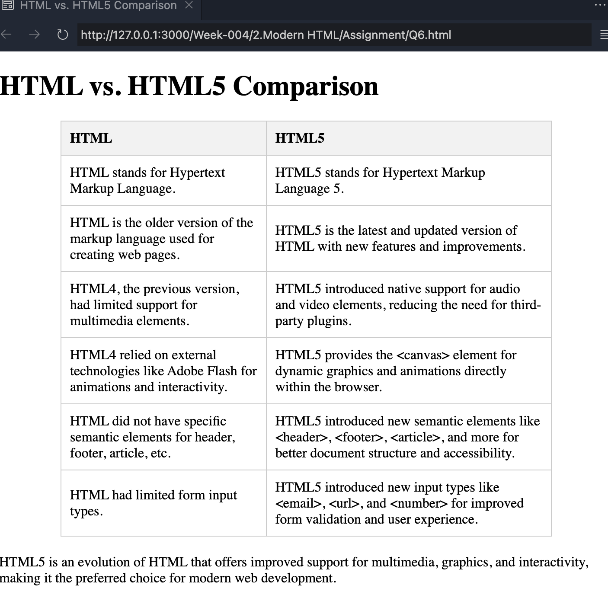

#

## Question 1: List out the features of HTML5.

## Question 2: What are HTML Entities? List out 5 commonly used HTML entities.

## Question 3: Define accessibility in the context of web development. Discuss why it's essential to create accessible websites and how it benefits different user group.

## Question 4: List any 3 ways which help us in improving the accessibility of HTML.

## Question 5: Create a web page that highlights the features of HTML5. Use appropriate semantic tags to structure the content and showcase at least three key features of HTML5 with explanations.

## Question 6: Create a simple web page which has a table. The table must have 2 columns HTML and HTML5. The table should include a minimum of three rows describing the differences between HTML and HTML5.

