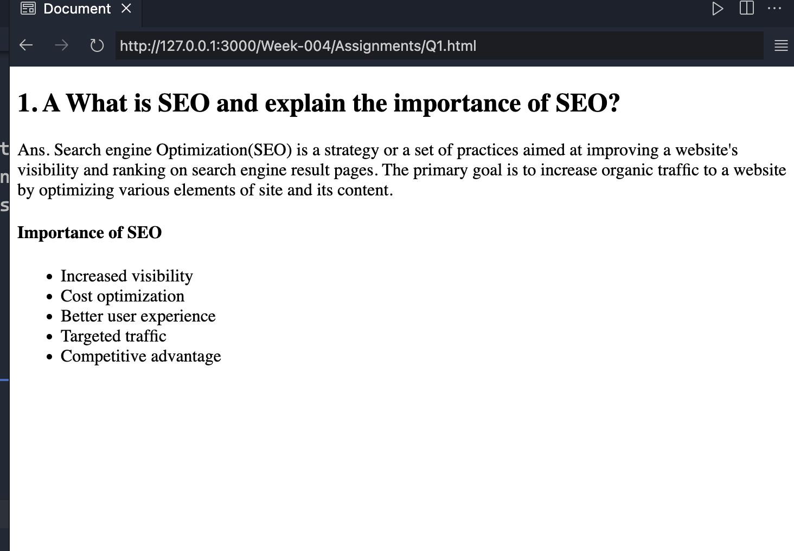
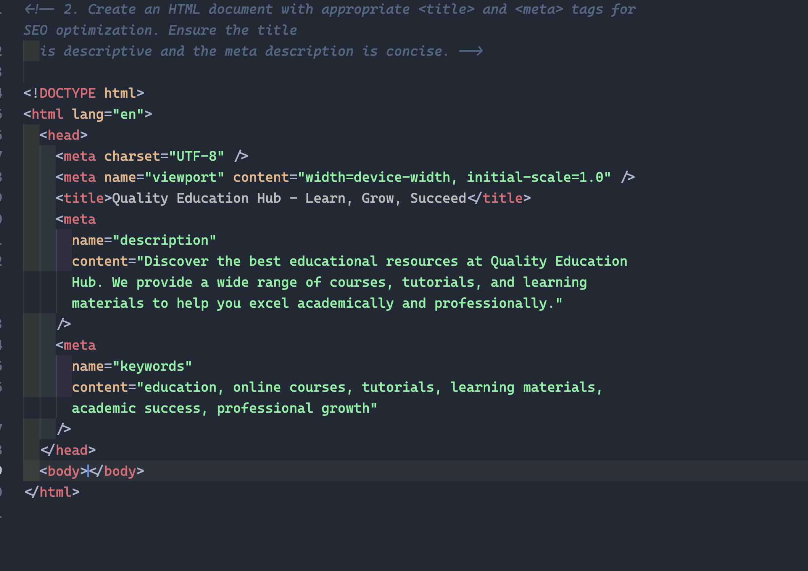
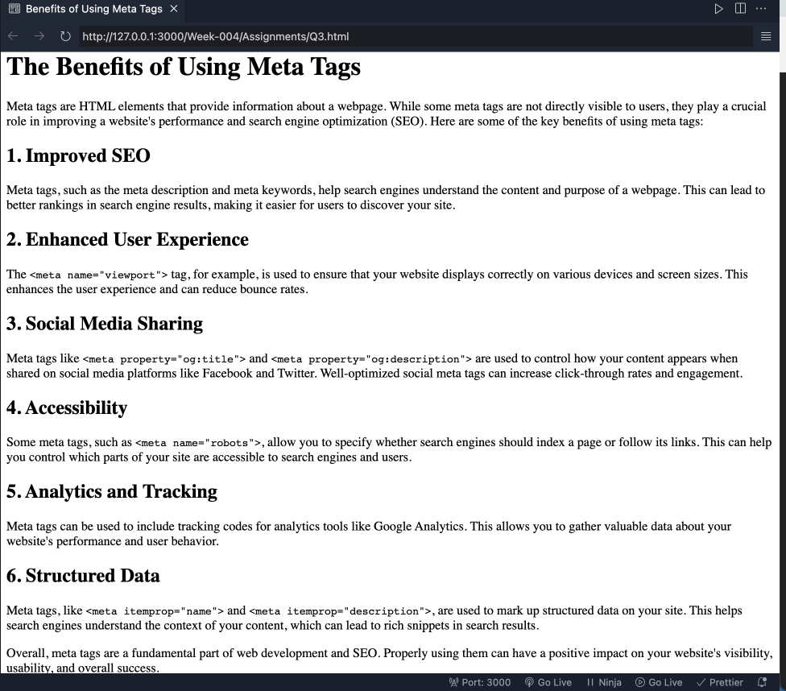
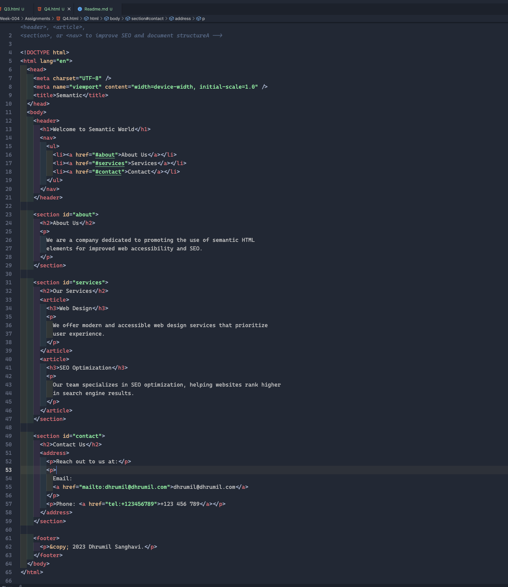
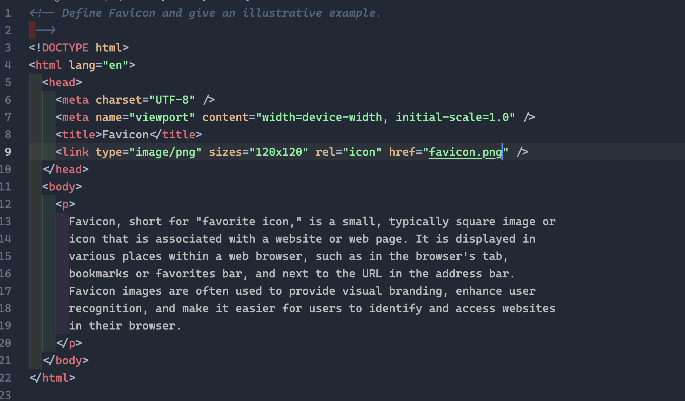

#

## Question 1: A What is SEO and explain the importance of SEO?

## Question 2: Create an HTML document with appropriate `<title>` and `<meta>` tags for SEO optimization. Ensure the title is descriptive and the meta description is concise.

## Question 3: What are the Benefits of Using meta tags?

## Question 4: Create an HTML document that properly incorporates semantic elements like `<header>`, `<article>`, `<section>`, or `<nav>` to improve SEO and document structure.

## Question 5: Define Favicon and give an illustrative example.

