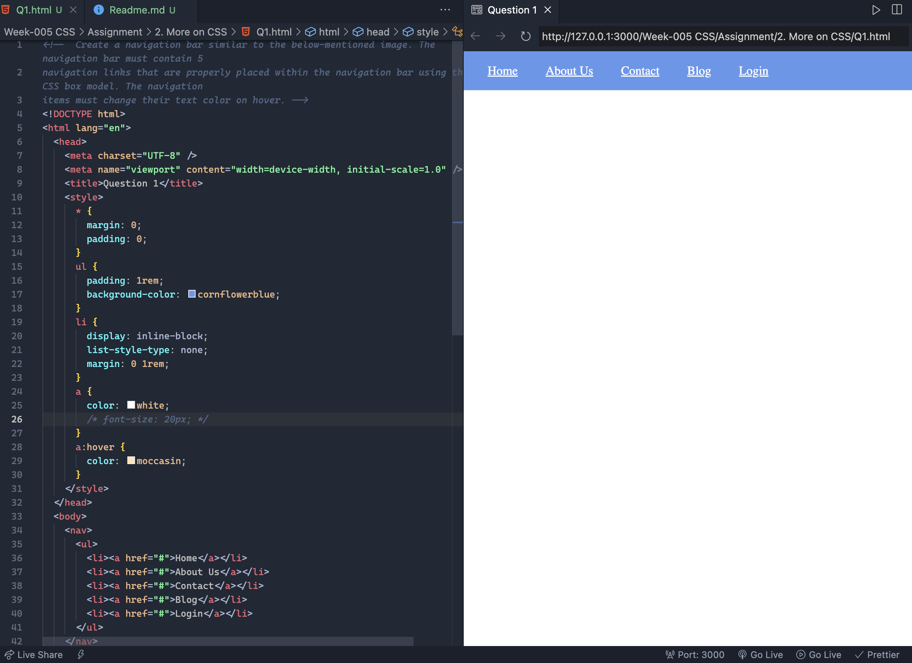
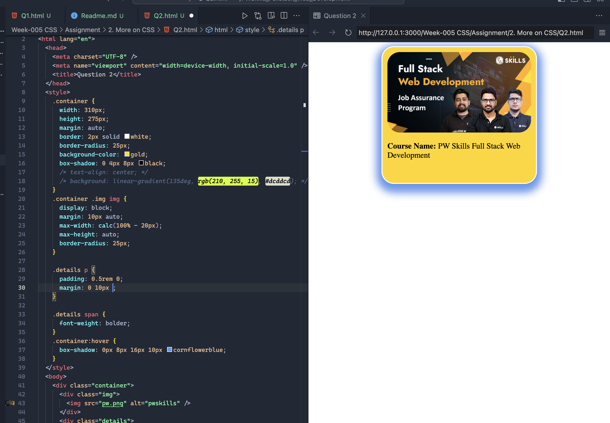
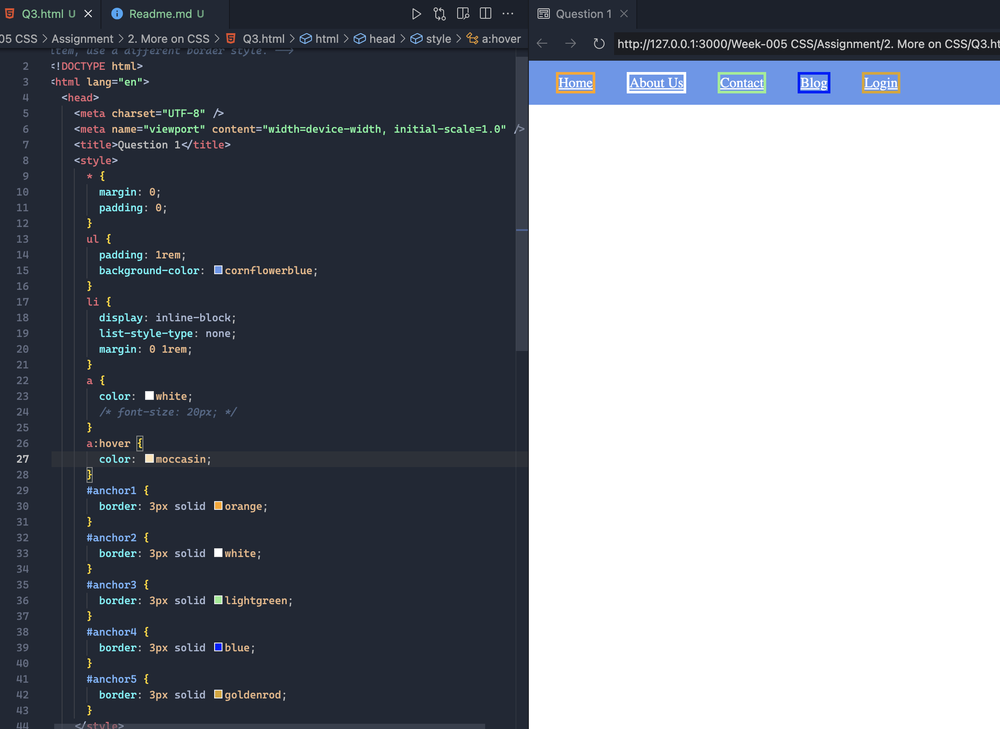
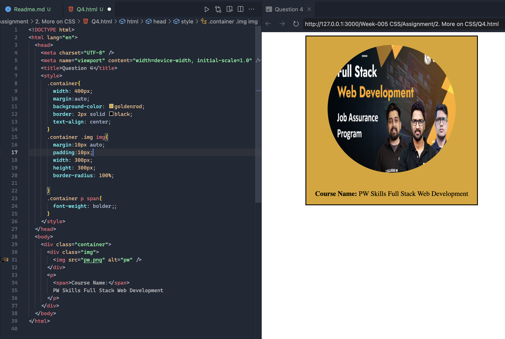
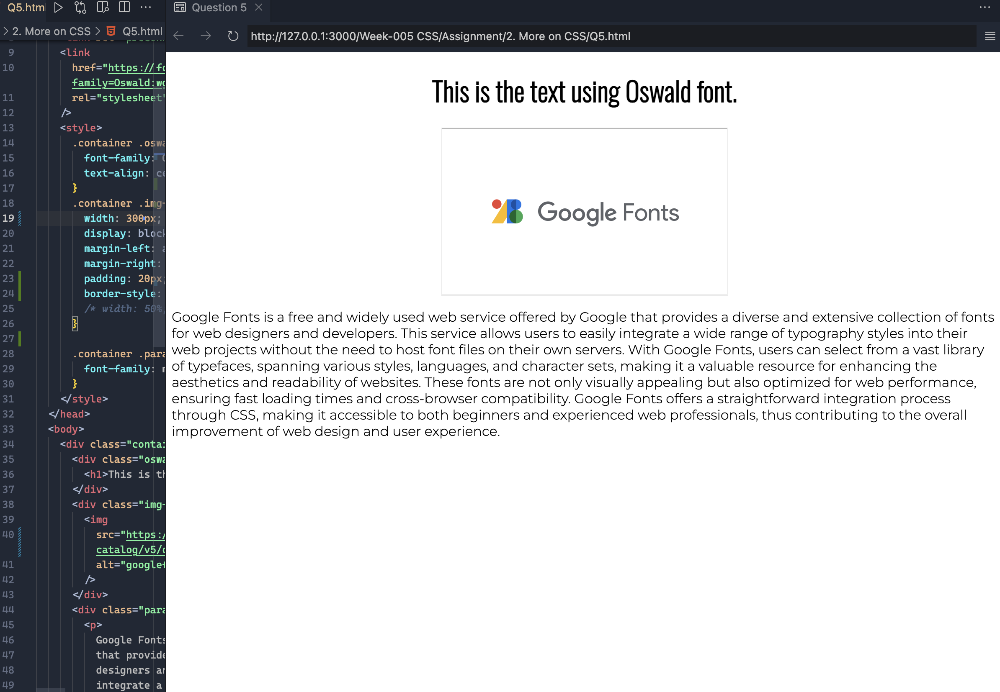
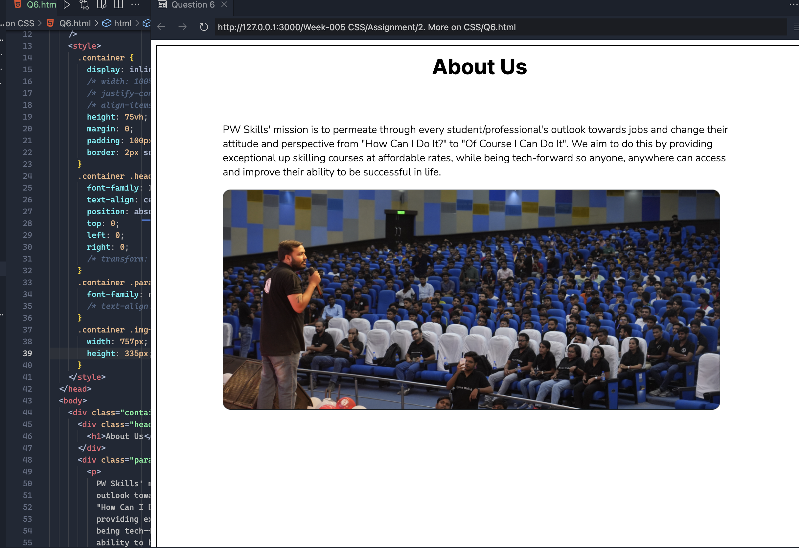
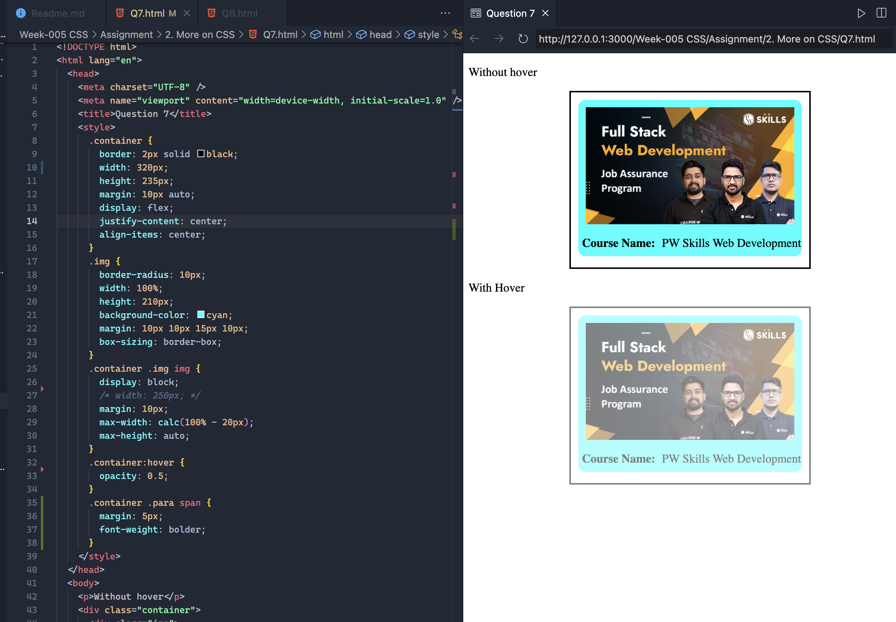
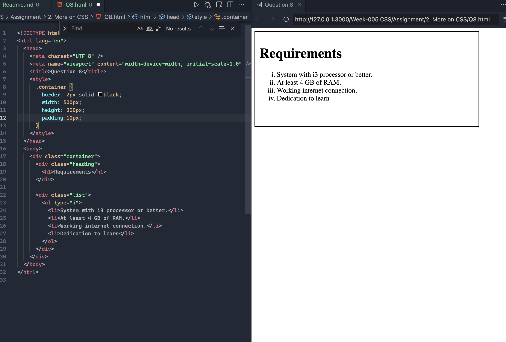

#

## Question 1:Create a navigation bar similar to the below-mentioned image. The navigation bar must contain 5 navigation links that are properly placed within the navigation bar using the CSS box model. The navigation items must change their text color on hover.

## Question 2: Build an HTML page with multiple paragraphs, each assigned a unique class name. Write CSS rules using class selectors to apply distinct styling to each paragraph. Follow the BEM naming convention and explain how you've named the classes.

## Question 3: Create a navigation bar similar to question 1. For each navigation item, use a different border style.

## Question 4: Create a simple webpage with an image and make the image circular using border-radius.

## Question 5 :Create a simple blog website about Google fonts. The webpage must have the heading with “Oswald” font align center to the page, below the heading have an image of Google fonts and a paragraph about Google fonts in font “Montserrat” paragraph font style should be“montserrat” font.

## Question 6 : Create a simple website as mentioned in the below image. You can get the assets by visiting https://pwskills.com/about-us.

## Question 7 : Create a simple webpage with a card similar to question number 2. The card must be semi-transparent as default and on hovering the card must be displayed clearly. Use CSS opacity to achieve this output.

## Question 8 : N; Create a simple list of items as mentioned in the below image.

