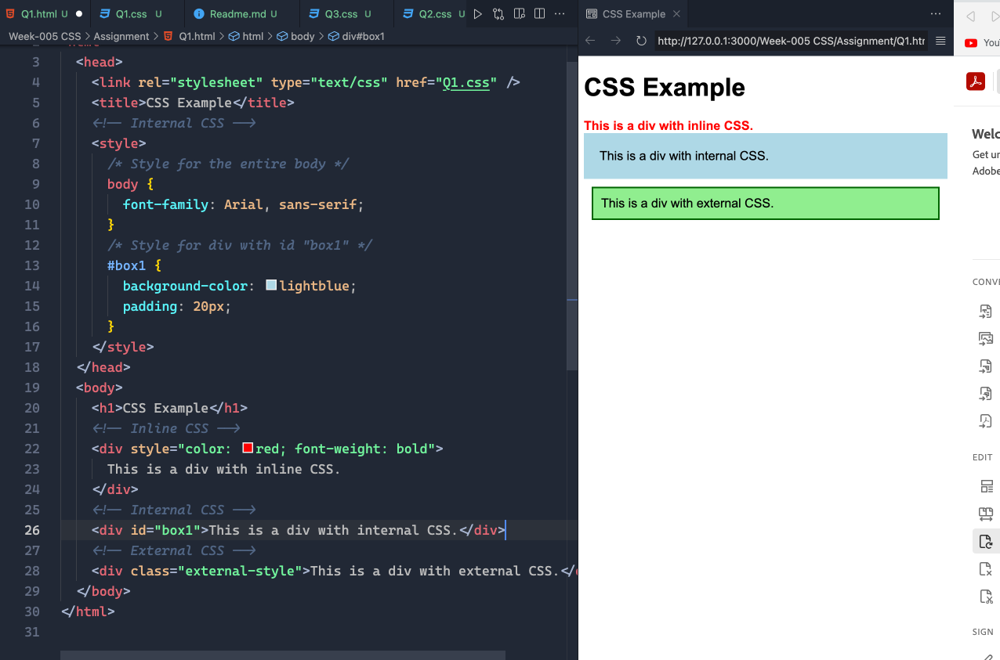
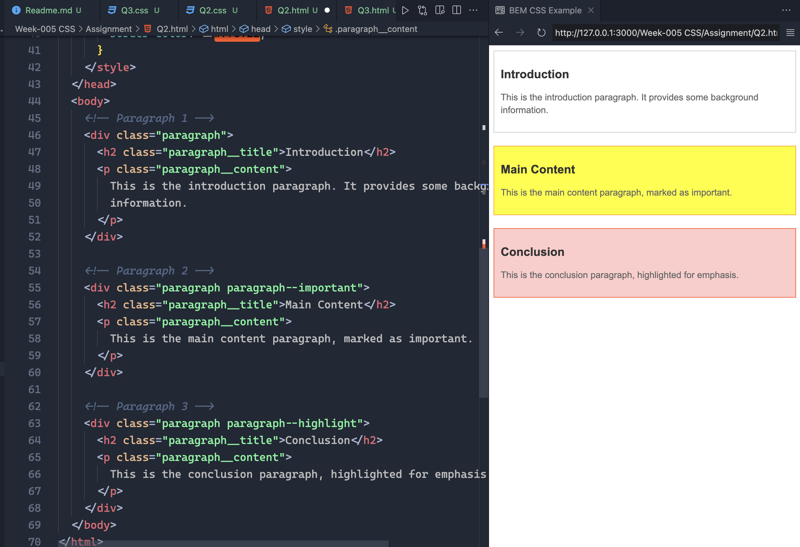
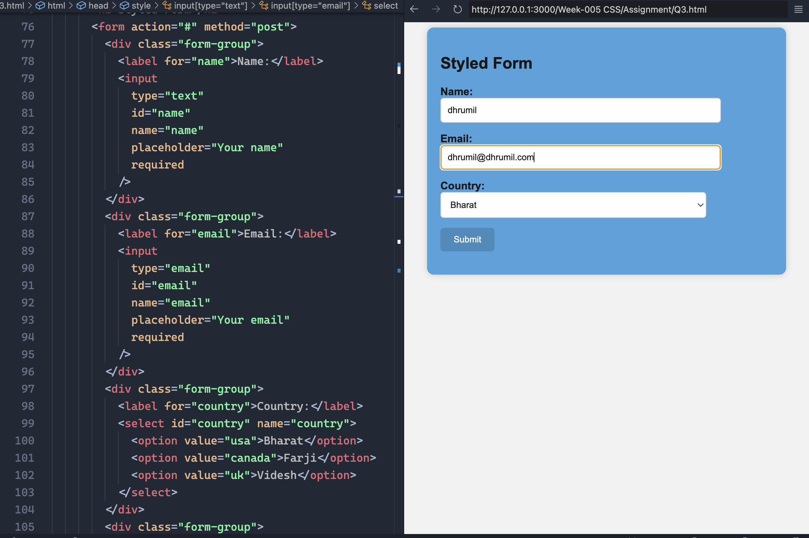

#

## Question 1: Create a simple page with some div tags and show different ways to add CSS as well as what happens when you target the same elements with inline, internal, and external CSS. Also, utilize comments in the project where required.

## Question 2: Build an HTML page with multiple paragraphs, each assigned a unique class name. Write CSS rules using class selectors to apply distinct styling to each paragraph. Follow the BEM naming convention and explain how you've named the classes.

## Question 3: Develop an HTML form with various input elements. Use CSS to style the form, including setting background colors for input fields. Create a custom color palette for the for the form elements, and demonstrate how to apply opacity to one of the form sections.

