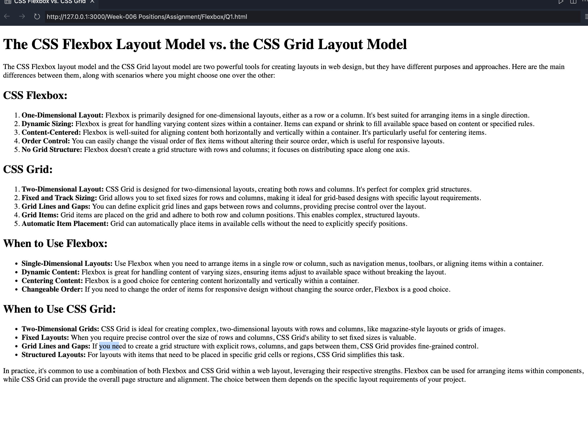
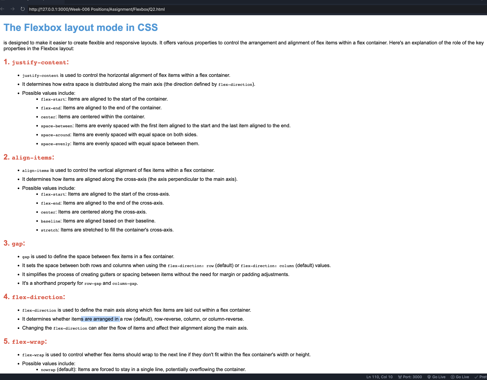
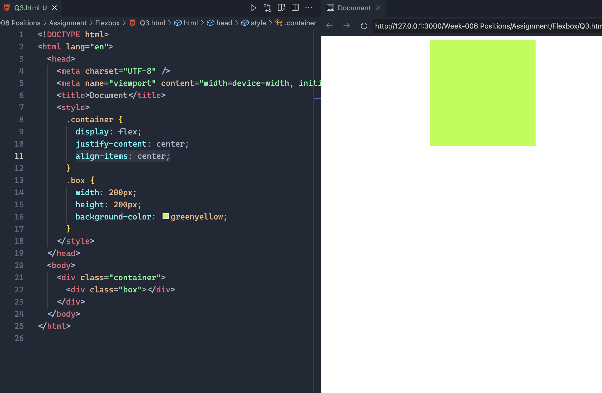
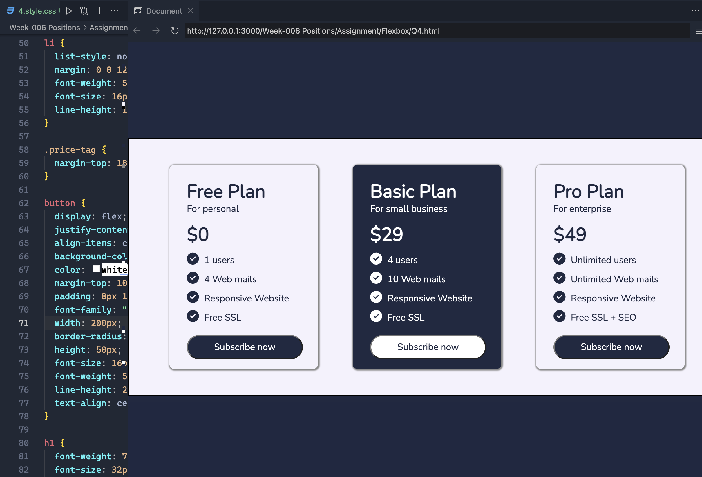
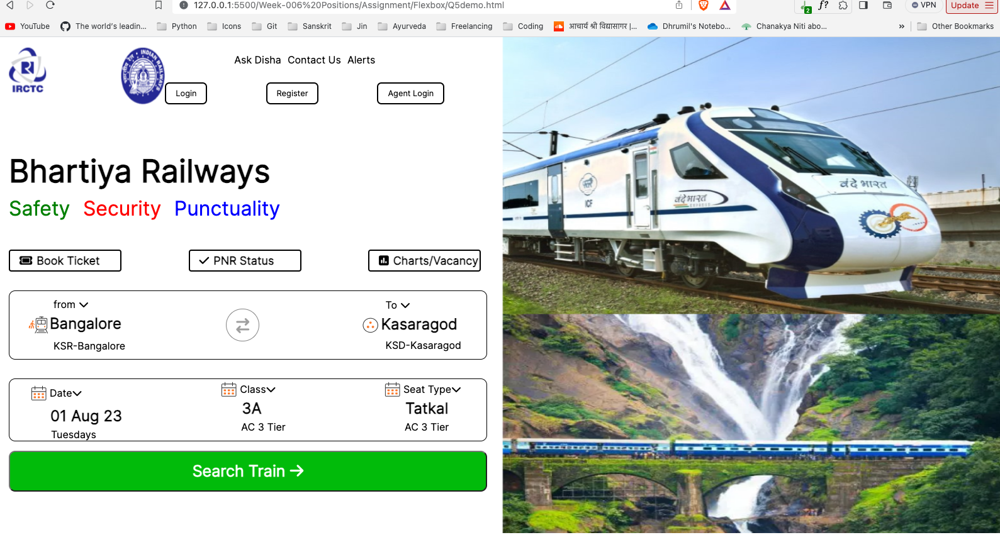

## Question 1: Describe the main differences between the CSS Flexbox layout model and the CSS Grid layout model. When would you choose to use one over the other?

## Question 2: Explain the role of the following key properties in the Flexbox layout mode 1. justify-content 2.align-items 3.gap 4.flex-direction 5.flex-wrap.

## Question 3: Create a card as shown in the picture below. (You can use CSS float property only for layout).

## Question 4: client of yours wants to add a pricing section on their website to showcase their newly introduced premium plans.You have to build the pricing section for their business. They have provided you with the figma design for the same.

[Link](<https://www.figma.com/file/jxwr0JO61tF9P06mmE9gph/Pricing-Card---Mark-1-(Community)-(Copy)?type=design&node-id=7-129&mode=design&t=FhMXfeE6IWGKrusF-0>)

## Question 5:Build a clone of the IRCTC website.Assets can be downloaded from the figma file provided below Link to the figma file: [Link](<https://www.figma.com/file/0nqHmoAXQq6iy8BhfdaYkO/IRCTC-Website-Design-(Community)-(Copy)?type=design&node-id=0-1&mode=design>)

