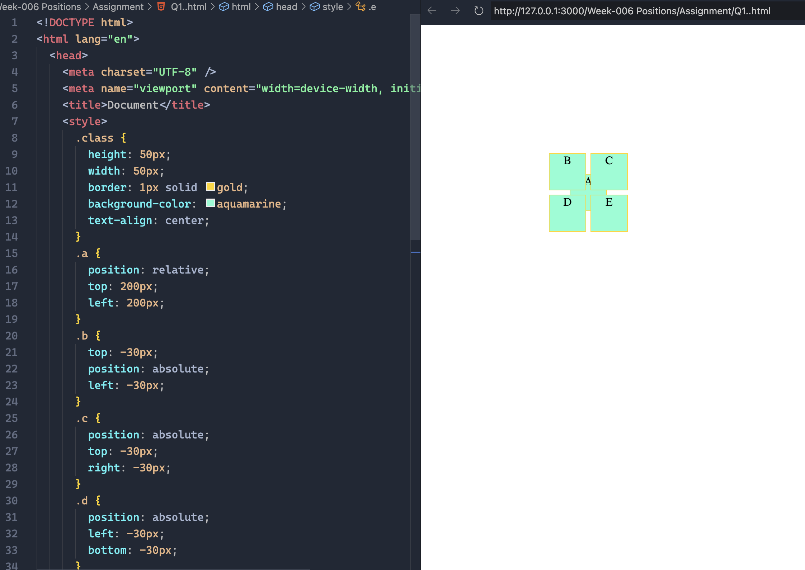
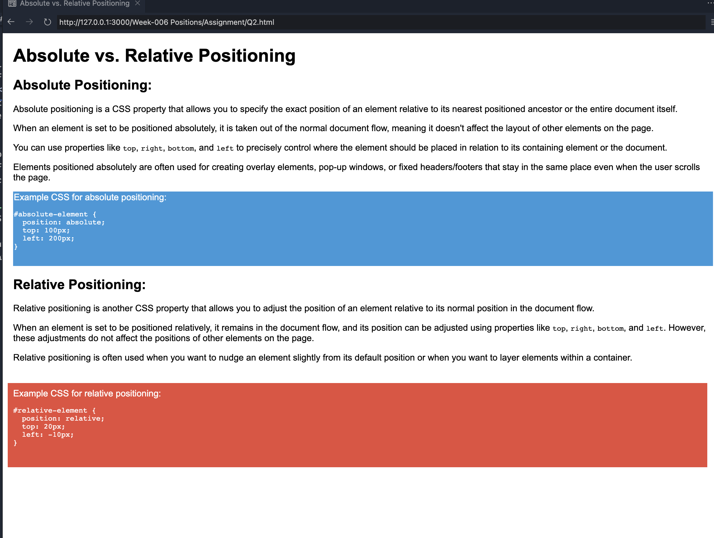
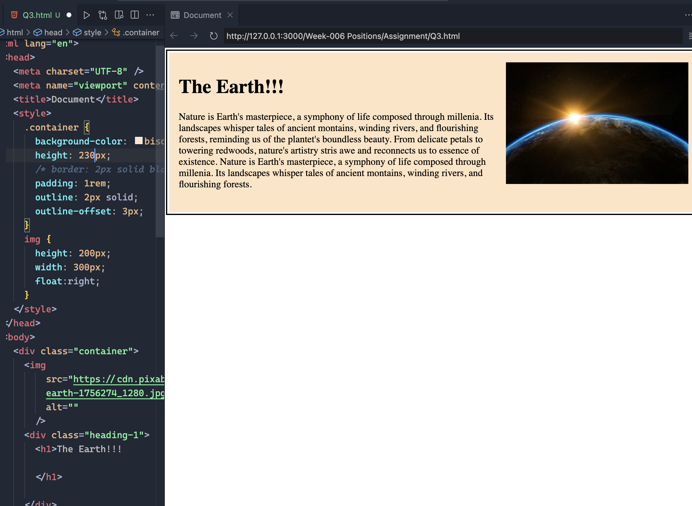
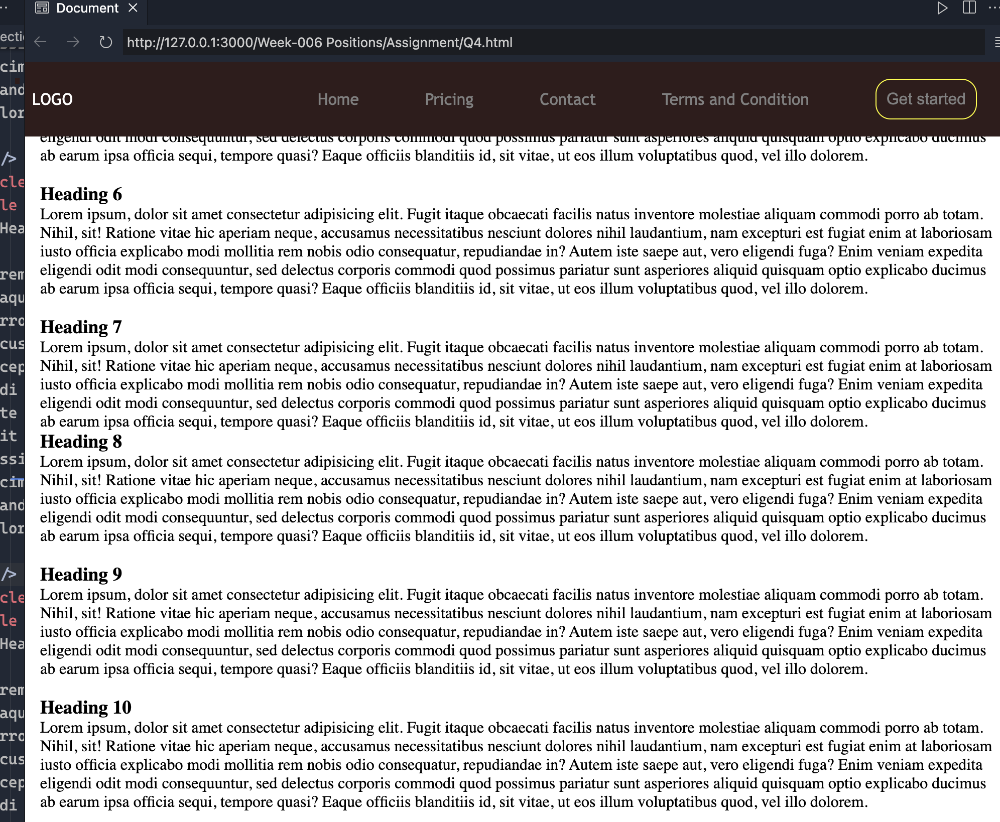
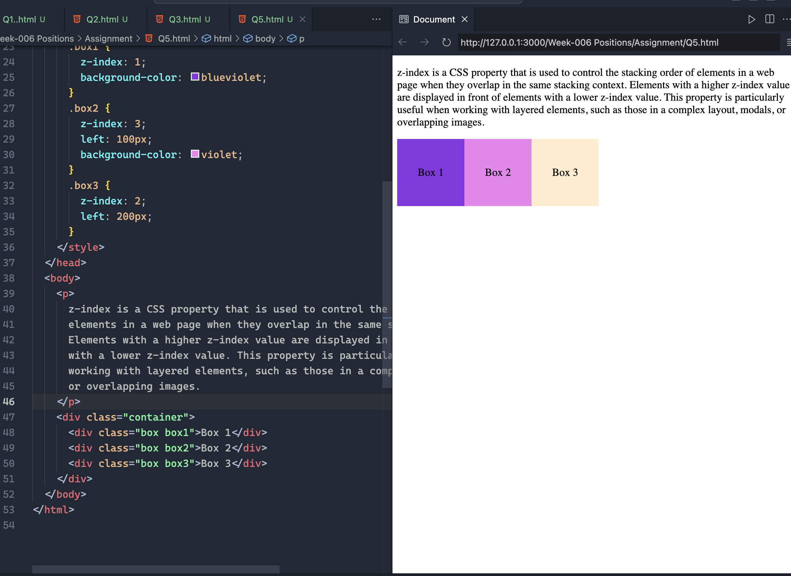

## Question 1: Write code to position 5 equal-sized (50 X 50px) boxes A, B, C, D, and E as follows, 1. box A 200px from the left, and 200px from the top of the viewport. 2. box B -30px left, and -30px above from the center of box A. 3. box B -30px right, and -30px above from the center of box A. 4. box B -30px left, and -30px below from the center of box A. 5. box B -30px right, and -30px below from the center of box A.

## Question 2: Explain the difference between Absolute and Relative positioning.

## Question 3: Create a card as shown in the picture below. (You can use CSS float property only for layout).

## Question 4: Create a simple header that sticks to the top of a webpage upon scrolling.

## Question 4: Explain z-index with example.

