## Question 1: Create a simple webpage with a header, a main content section, and a footer. Apply a media query that changes the background color of the header to blue when the screen width is less than 600px.

|                 Normal screen                  |                  600px screen                  |
| :--------------------------------------------: | :--------------------------------------------: |
| 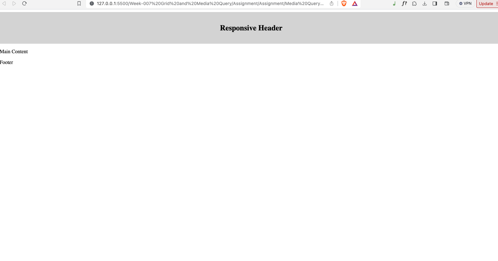 | 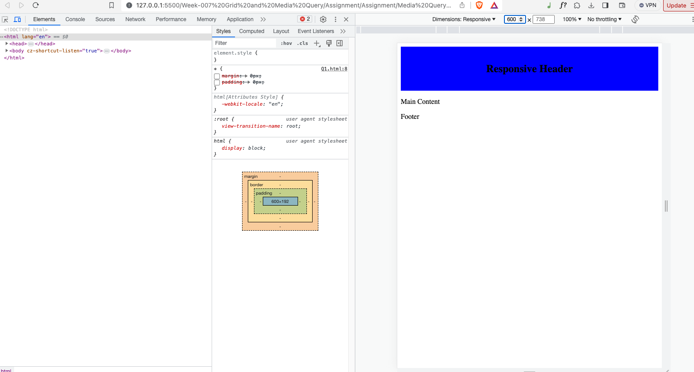 |

<!--  -->

## Question 2: Create an image gallery with three images in a row. Use media queries to adjust the layout to two images in a row for screens smaller than 800px and one image in a row for screens smaller than 500px. For image use this link

[Image Link](https://images.unsplash.com/photo-1431538510849-b719825bf08b?auto=format&fit=crop&q=80&w=1846&ixlib=rb-4.0.3&ixid=M3wxMjA3fDB8MHxwaG90by1wYWdlfHx8fGVufDB8fHx8fA%3D%3D)

|                 Normal screen                  |                  800px screen                  |                     500px                      |
| :--------------------------------------------: | :--------------------------------------------: | :--------------------------------------------: |
| 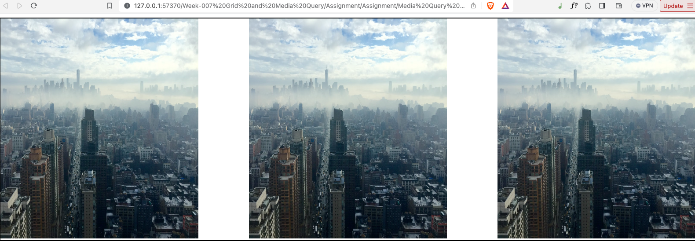 | 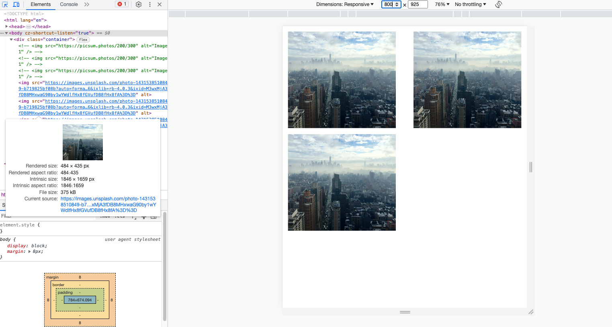 | 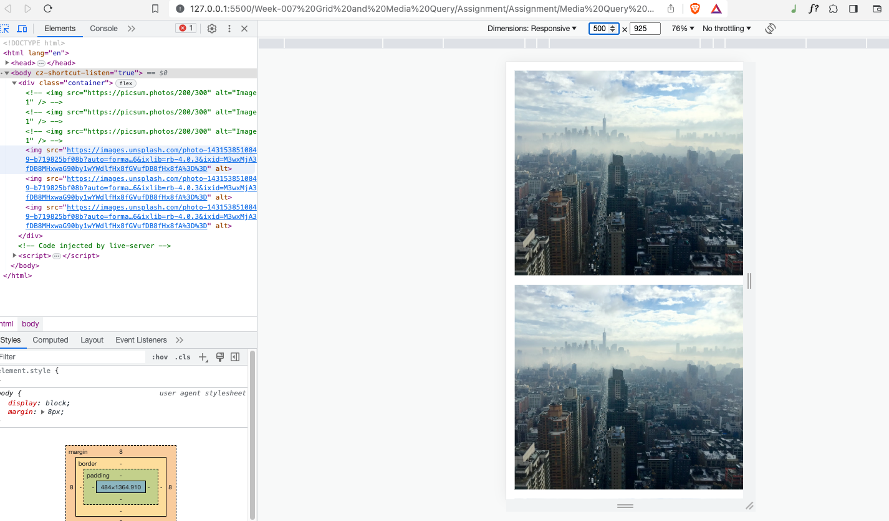 |

<!--  -->

## Question 3: Problem Statement Create a navigation bar with five links. Apply a media query that converts the navigation into a vertical list for screens smaller than768px and also changes the background color to gray.

|                 Normal screen                  |                  485px screen                  |
| :--------------------------------------------: | :--------------------------------------------: |
| 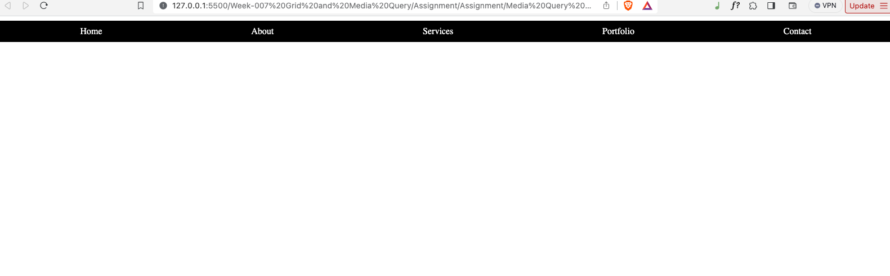 | 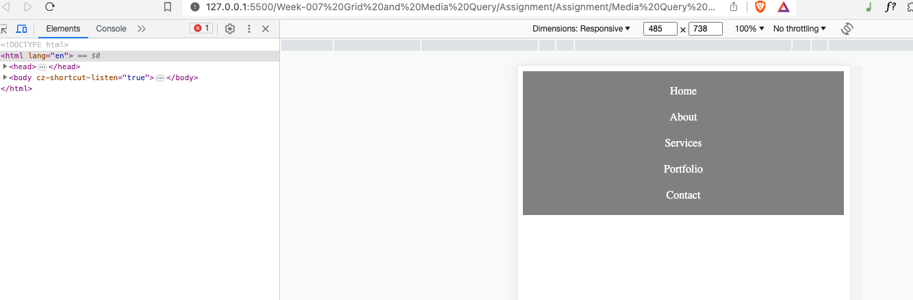 |

<!--  -->

## Question 4: Create a grid based layout containing four grid items which arranges them as the screen size changes.

|                 Normal screen                  |                  490px screen                  |
| :--------------------------------------------: | :--------------------------------------------: |
| 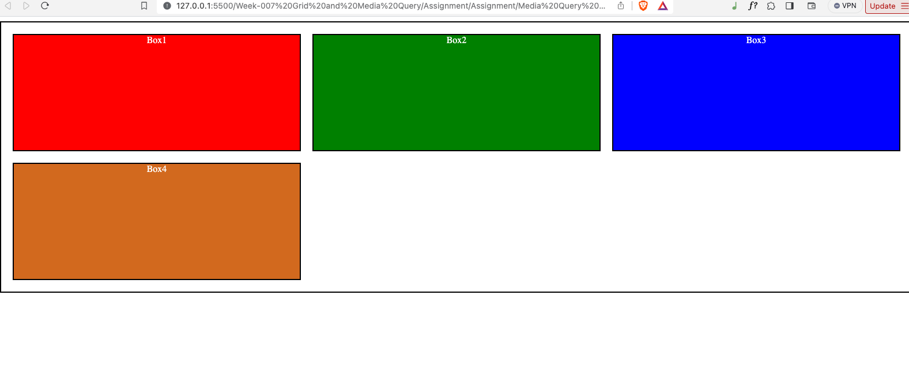 | 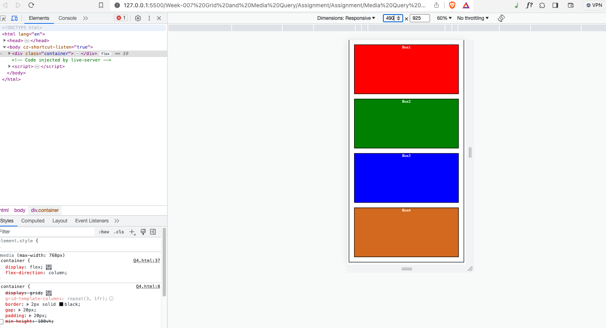 |

<!--  -->

## Question 5: Create the below given layout using the flexbox in css, which should adapt itself on mobile screen as per given below output.

|                 Normal screen                  |                  490px screen                  |
| :--------------------------------------------: | :--------------------------------------------: |
| 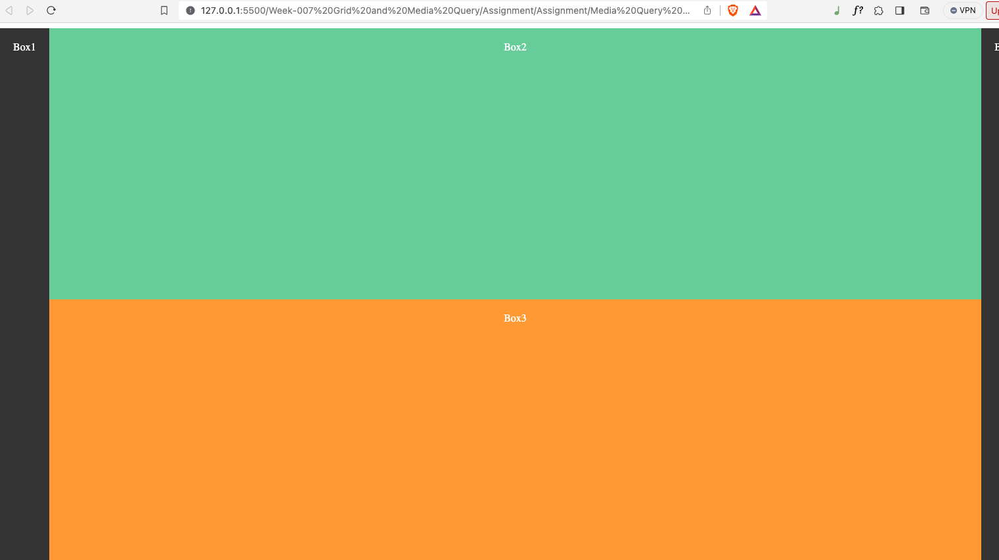 | 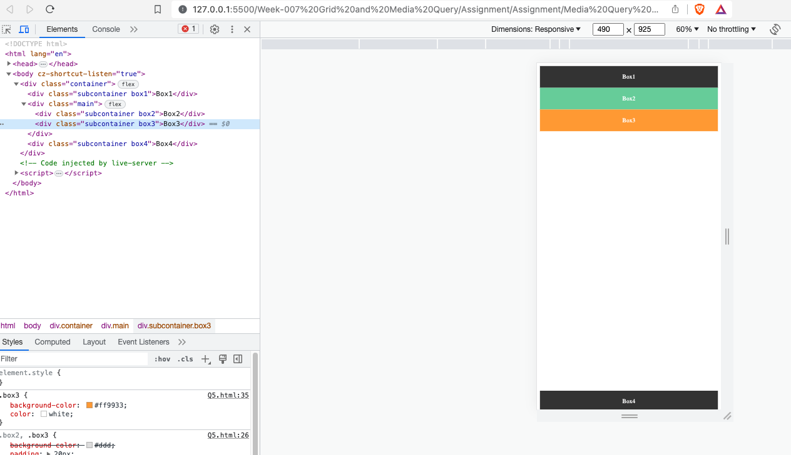 |

<!--  -->
