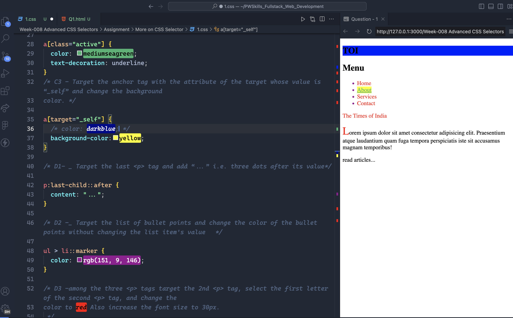
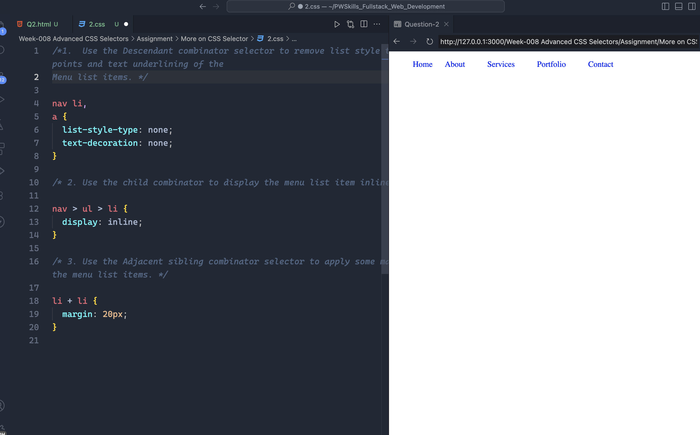
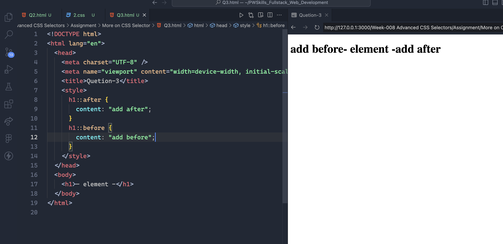
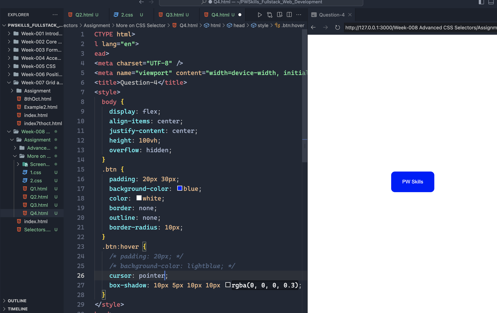
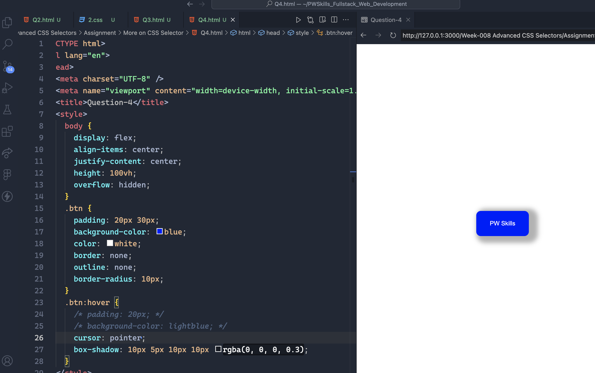

## Question 1: For the given index.html file. Perform the following task, without changing the index.html file.

A. Create a CSS file to apply styles to the HTML element, and link it.
B. Using the combinator selector, perform the following task.

- Use any of the CSS combinator selectors to target all the anchor tags and change the text color to red
- Target only the first `<h2>` tag and change the text and background color using the combinator selector.
- Also, select the first `
` tag and change the text color to red.

C. Using the attribute selector, perform the following task:

- Target the anchor tag with attribute "href" and change color to red and remove the text underline¢
- Target the anchor tag with the attribute of class name “active”, change the text color, and provide the text style properties with underlining
- Target the anchor tag with the attribute of the target whose value is “\_self” and change the background color.

D. Using the Pseudo selectors, perform the following task:

- Target the last `
` tag and add “...” i.e. three dots after its value.
- Target the list of bullet points and change the color of the bullet points without changing the list item's value.
- Among the three `
` tags target the 2nd `
` tag, select the first letter of the second `
` tag, and change the color to red Also increase the font size to 30px.
  

## Question 2: Create a CSS file and link it to the provided HTML file below, use any of the combinator class selectors to style the navigation menu as follows -

- Use the Descendant combinator selector to remove list style type bullet points and text underlining of the Menu list items.
- Use the child combinator to display the menu list item inline
- Use the Adjacent sibling combinator selector to apply some margin between the menu list items.

 |

## Question 3: Using any of the Pseudo element selectors, add any random words after and before the given HTML tag.

## Question 4: Using any of the Pseudo element selectors, add any random words after and before the given HTML tag

- An example should be one HTML button tag  
- When hovering the color should be changed and the shadow of the button should be added.
- Proper padding space should be given.
- The cursor style should also be changed to a pointer on hover

|                 Without Hover                  |                   With Hover                   |
| :--------------------------------------------: | :--------------------------------------------: |
|  |  |
