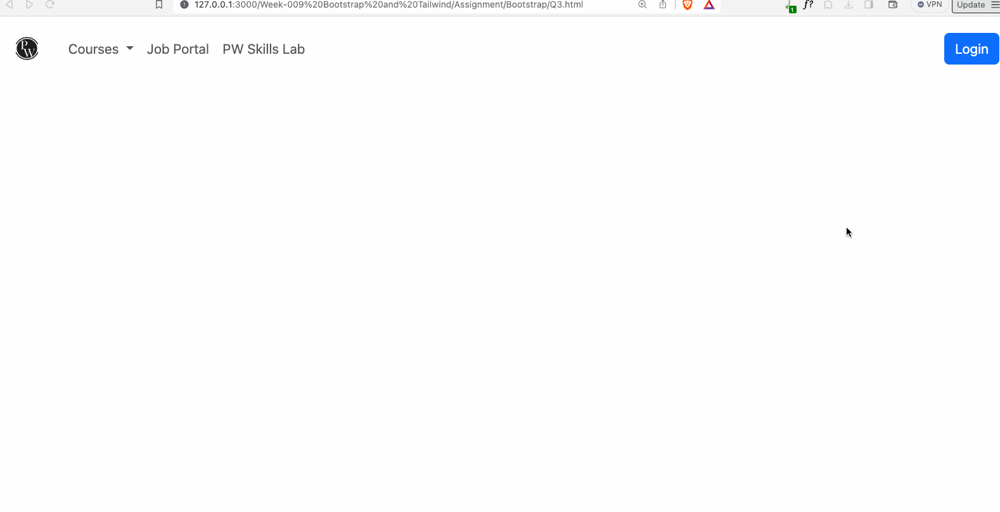

## Question 1: You have to create a course card which should contain the thumbnail image, title and description with a call to action button. For course thumbnail image use the given image link. [link](https://cdn.pwskills.com/assets/uploads/thumbnails/64a514966977cc6e87e27504.png)

## Question 2: In the assignment you have to create a simple carousel consisting of three slides with a controller and indicator on it to make it easy for the user to navigate to other slides easily. Also for all these three slides, you have to gather the image from the pw skills website (https://pwskills.com/). Any three recent course images can be used in it.

## Question 3: Create a navigation menu which should consist of the pw logo, simple navigation menu items like courses, job portal etc and at last there should be a login button, if the user clicks on the login button a modal should open with a form for taking user email and password with a login button in it to submit that form.

<!-- |                 Normal screen                  |                  485px screen                  |
| :--------------------------------------------: | :--------------------------------------------: |
|  |  | -->

