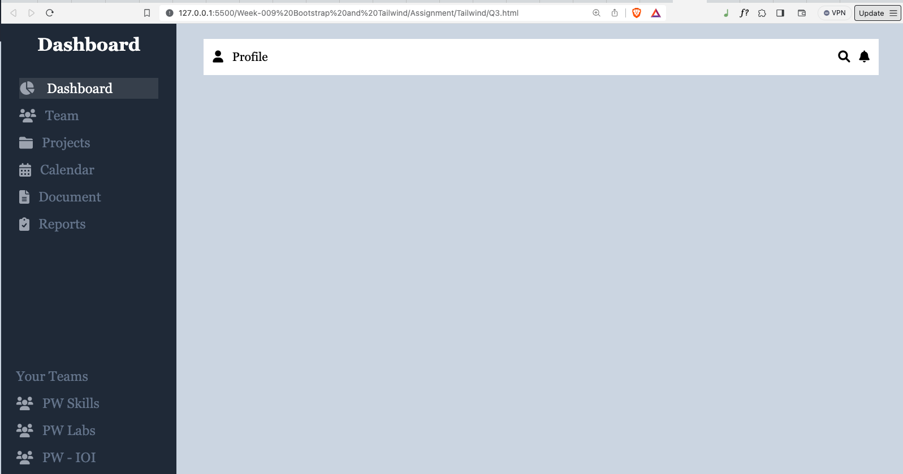

## Question 1: Create a User login page interface that closely resembles the provided image using Tailwind CSS. The goal is to ensure that your implementation captures every visual detail and layout aspect depicted in the image while maintaining a full mobile responsiveness. Get the image from

[link](https://www.freepik.com/free-photo/young-happy-woman-with-good-idea-sign-white-shirt-full-portrait_10881326.htm#page=2&query=login&position=11&from_view=search&track=sph)

## Question 2:Create a responsive image gallery using Tailwind CSS. The gallery should display a grid of images that adjust their size and layout based on the screen size.

## Question 3: Create a non-responsive dashboard using Tailwind CSS, where the dashboard should include a sidebar navigation menu and a main contain area. (Making it responsive is optional). Feel free to use any icons from any place, Your goal is to design a visually appealing and user-friendly dashboard interface that is not responsive.

<!-- |                 Normal screen                  |                  485px screen                  |
| :--------------------------------------------: | :--------------------------------------------: |
|  |  | -->

