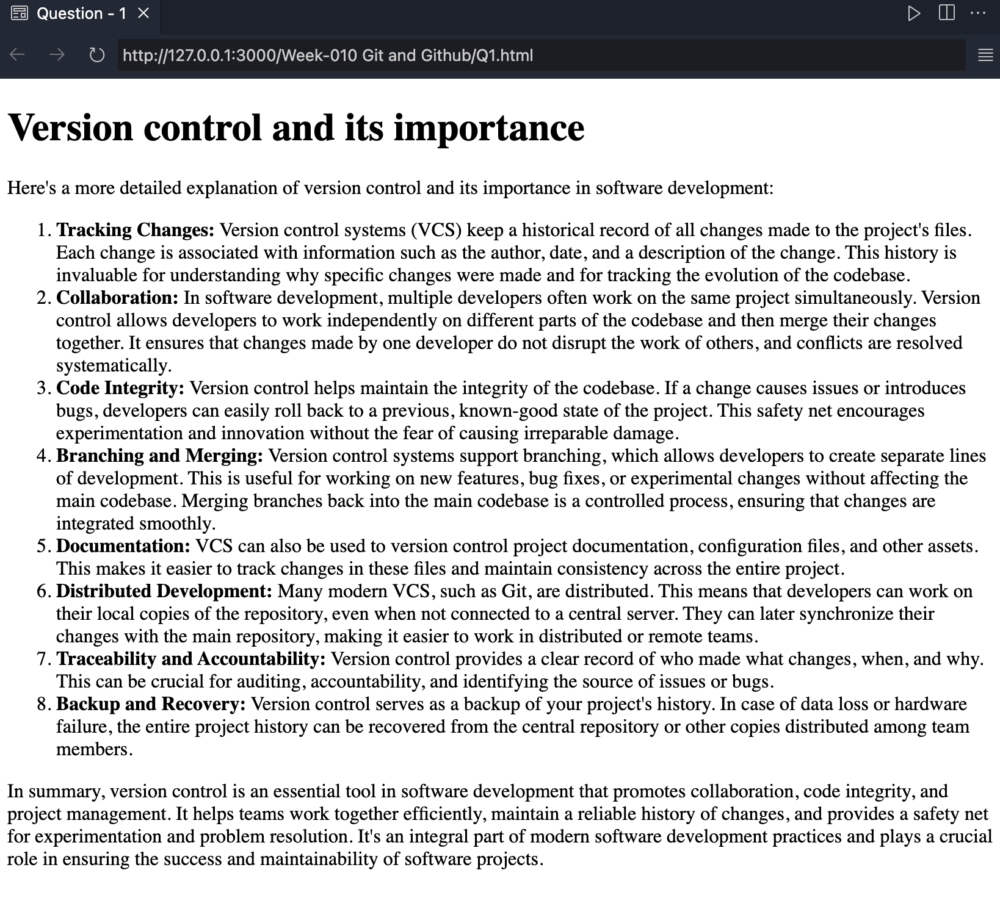
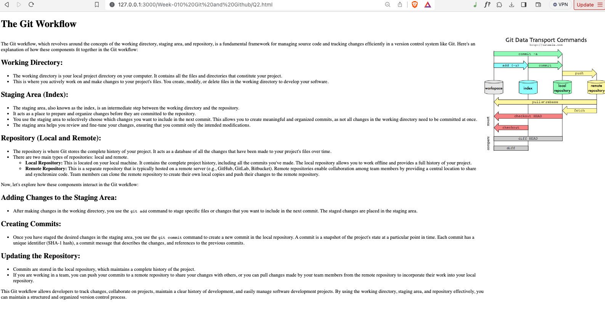
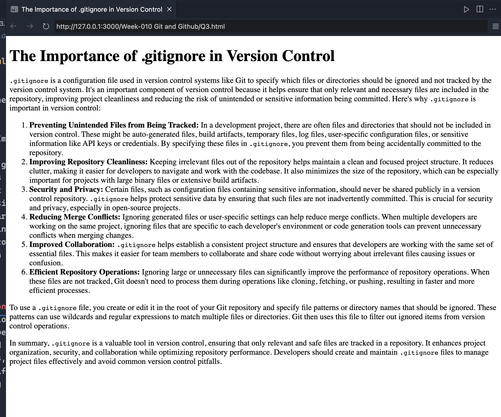

## Question 1: Explain what version control is and its importance in software development.

## Question 2: Explain the Git Workflow, including the staging area, working directory, and repository.

## Question 3: Explain what .gitignore is and why it’s important in version control.

<!-- |                 Normal screen                  |                  485px screen                  |
| :--------------------------------------------: | :--------------------------------------------: |
|  |  | -->

## Question 4: Briefly explain what GitHub is and how it facilitates collaboration and version control also name some alternatives to GitHub.

## Question 5: Describe the process of contributing to any open-source project on GitHub in a step-by-step manner.

