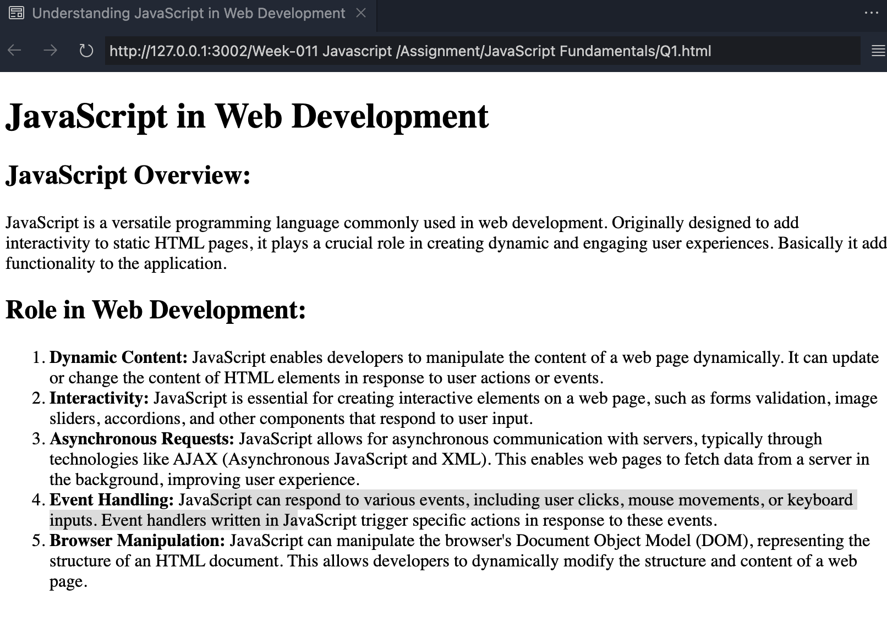
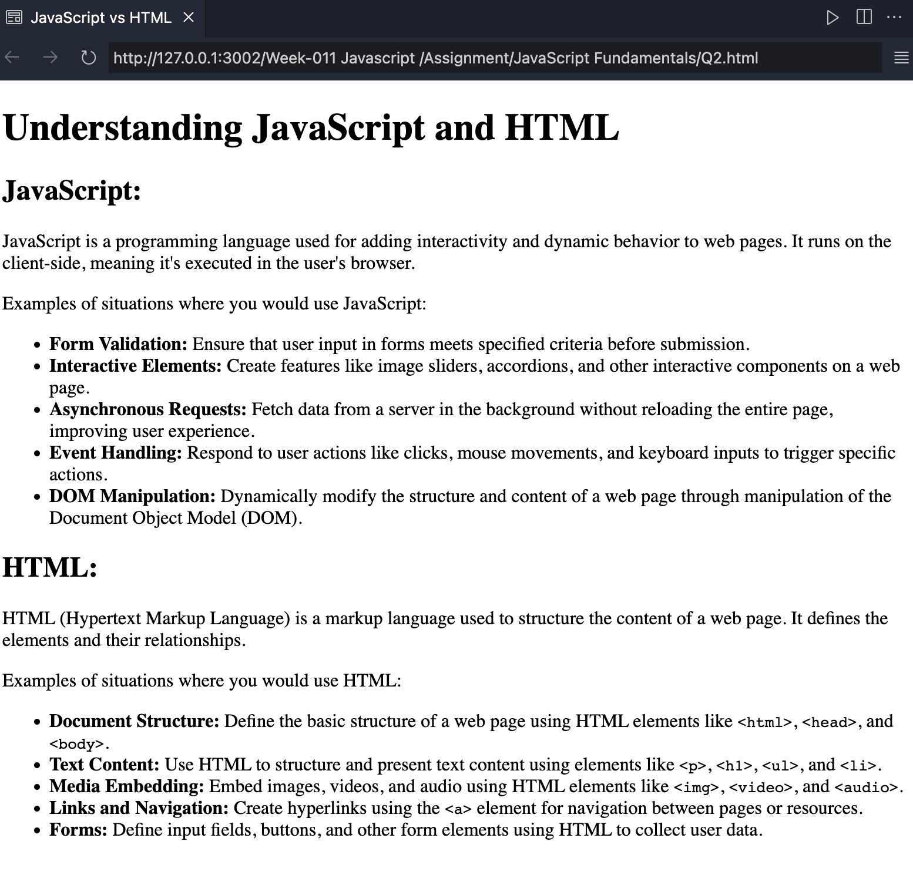
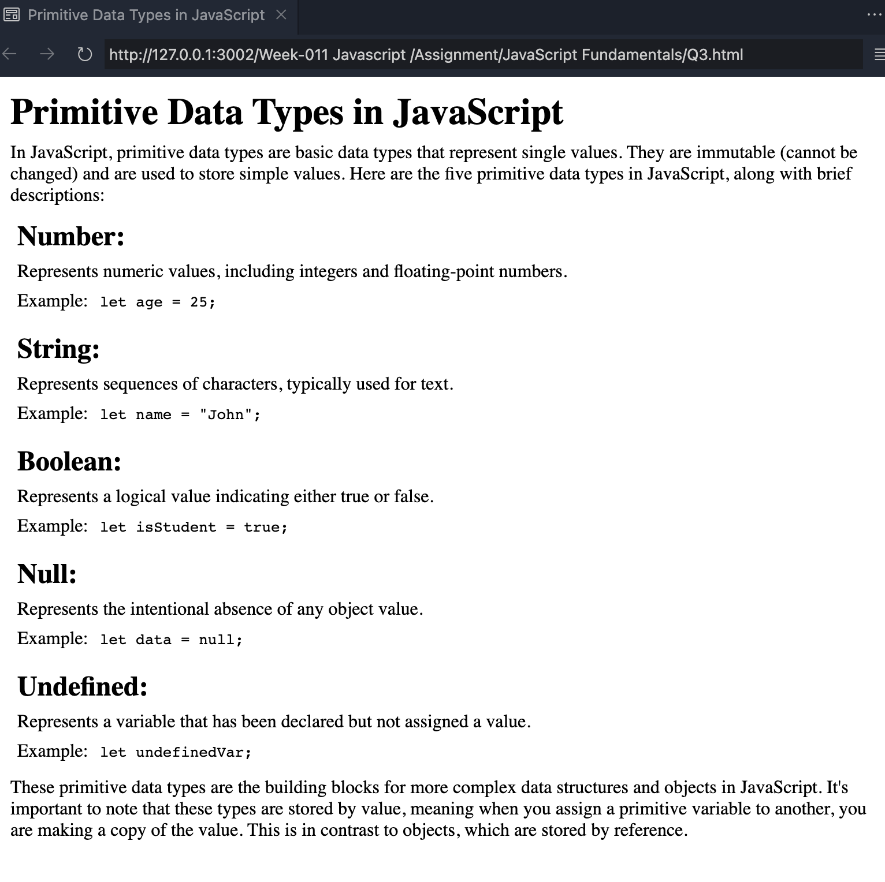
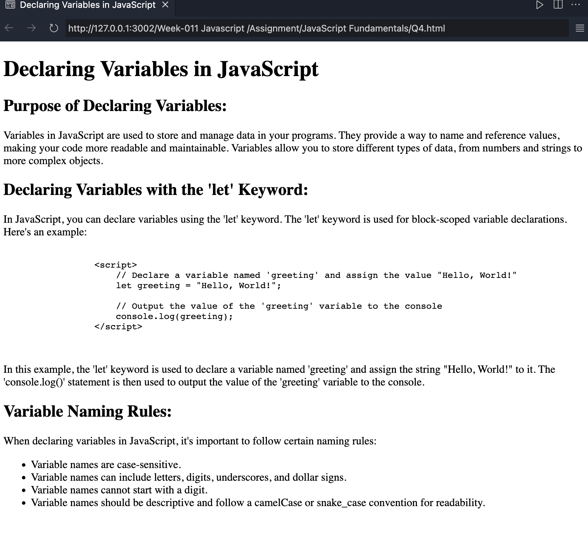
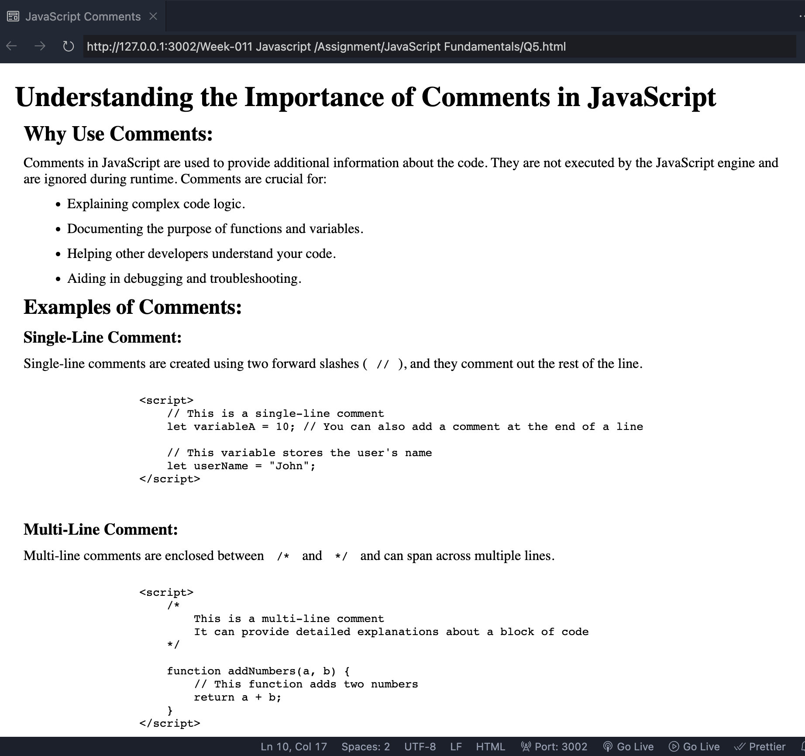
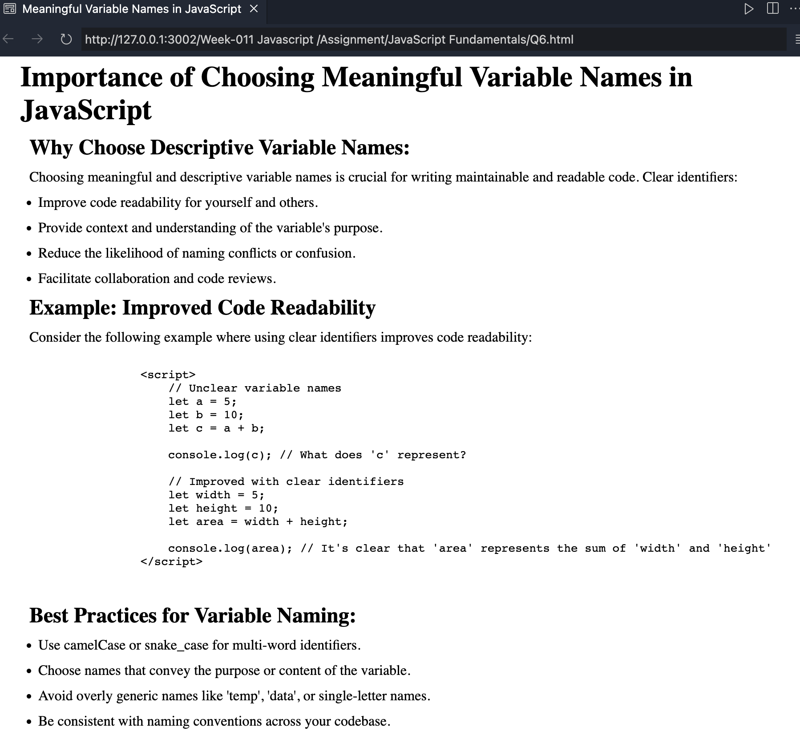

## Question 1: Explain what JavaScript is and its role in web development.

## Explain the key differences between JavaScript and HTML. Provide examples of situations where you would use each.

 |

## Question 3: List and describe the five primitive data types in JavaScript.

## Question 4: What is the purpose of declaring variables in JavaScript, and how do you declare them using the 'let' keyword?

<!--
|                 Without Hover                  |                   With Hover                   |
| :--------------------------------------------: | :--------------------------------------------: |
|  |  | -->

## Question 5: Explain the importance of comments in JavaScript and provide examples of single-line and multi-line comments.

## Question 6: Explain the importance of choosing meaningful and descriptive variable names in JavaScript. Provide an example where using a clear identifier improves code readability.

