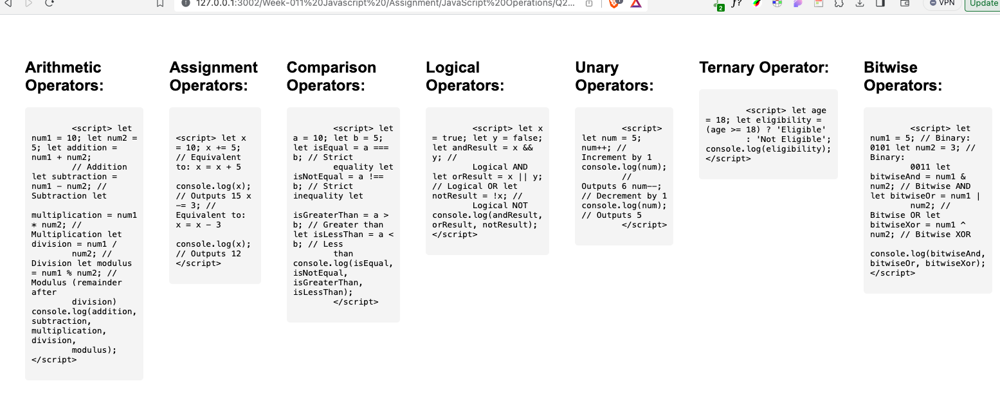
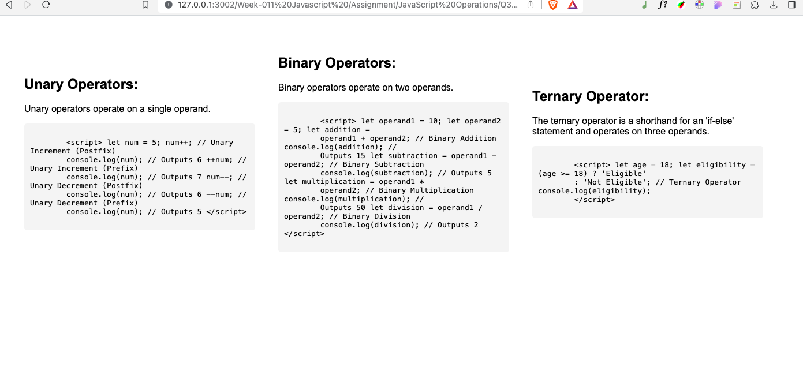
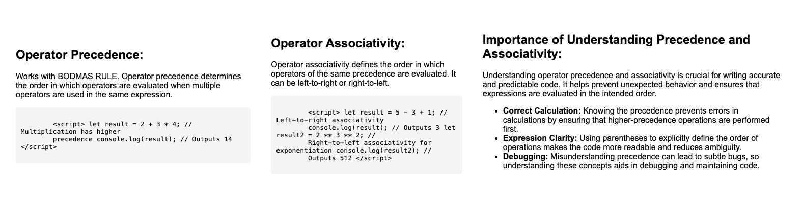
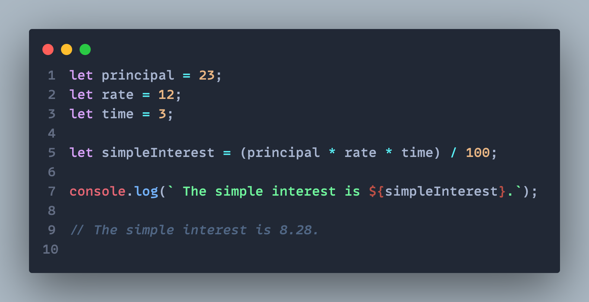
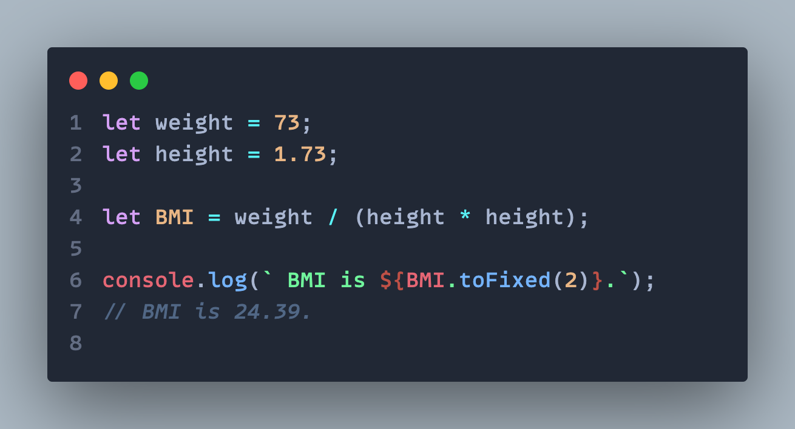
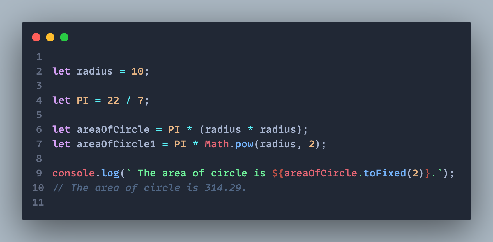

## Question 1: Explain what JavaScript is and its role in web development.

## Explain the key differences between JavaScript and HTML. Provide examples of situations where you would use each.

 |

## Question 3: List and describe the five primitive data types in JavaScript.

## Question 4: What is the purpose of declaring variables in JavaScript, and how do you declare them using the 'let' keyword?

<!--
|                 Without Hover                  |                   With Hover                   |
| :--------------------------------------------: | :--------------------------------------------: |
|  |  | -->

## Question 5: Explain the importance of comments in JavaScript and provide examples of single-line and multi-line comments.

## Question 6: Explain the importance of choosing meaningful and descriptive variable names in JavaScript. Provide an example where using a clear identifier improves code readability.

## Question 1: Explain the role of operators in JavaScript. Why are they essential in programming?

## Question 2: Describe the categorization of operators in JavaScript based on their functionality. Provide examples for each category.

 |

## Question 3: Differentiate between unary, binary, and ternary operators in JavaScript. Give examples of each.

## Question 4: Discuss the precedence and associativity of operators in JavaScript. Why is understanding these concepts important?

<!--
|                 Without Hover                  |                   With Hover                   |
| :--------------------------------------------: | :--------------------------------------------: |
|  |  | -->

## Question 5: Write a JavaScript program that calculates the simple interest using the formula Simple interest = (principal _ rate _ time) / 100.

## Question 6: Write a Javascript program to calculate the Body Mass Index (BMI) using the formula BMI = weight (kg)/ height \* height.

## Question 7:Write a program in JavaScript to calculate the area of a circle given its radius value of 10. Use appropriate arithmetic operators.

