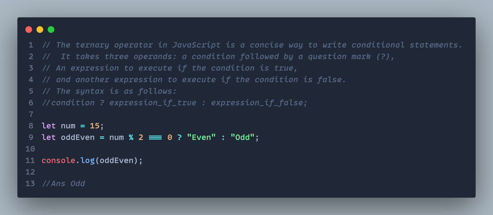
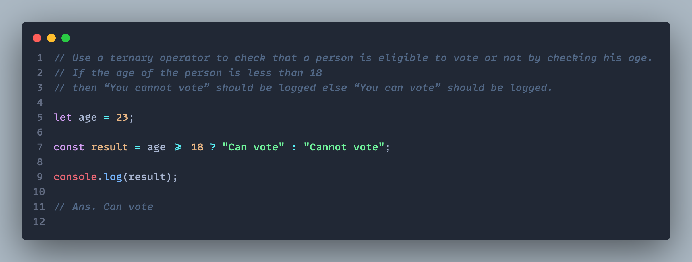

## Question 1:Explain the usage of ternary operator with syntax and write a program to check whether the number is even or odd using the ternary operator.

## Question 2: Describe the usage of the comma operator in JavaScript and provide an example.

 |

## Question 3: Use a nested ternary operator to check that a number is positive, negative or zero. You have to print “positive” if the number is positive and similarly for negative and zero also.

## Question 4: What is the purpose of declaring variables in JavaScript, and how do you declare them using the 'let' keyword?

<!--
|                 Without Hover                  |                   With Hover                   |
| :--------------------------------------------: | :--------------------------------------------: |
|  |  | -->
