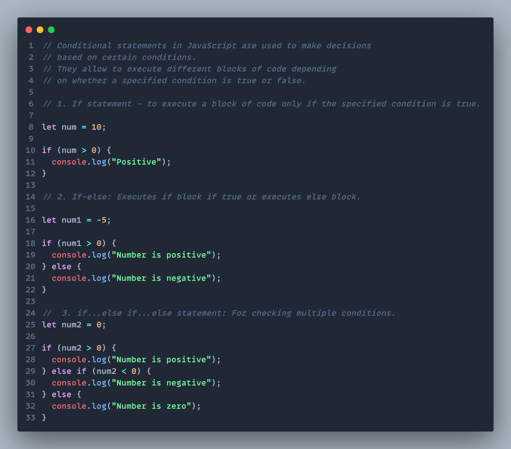
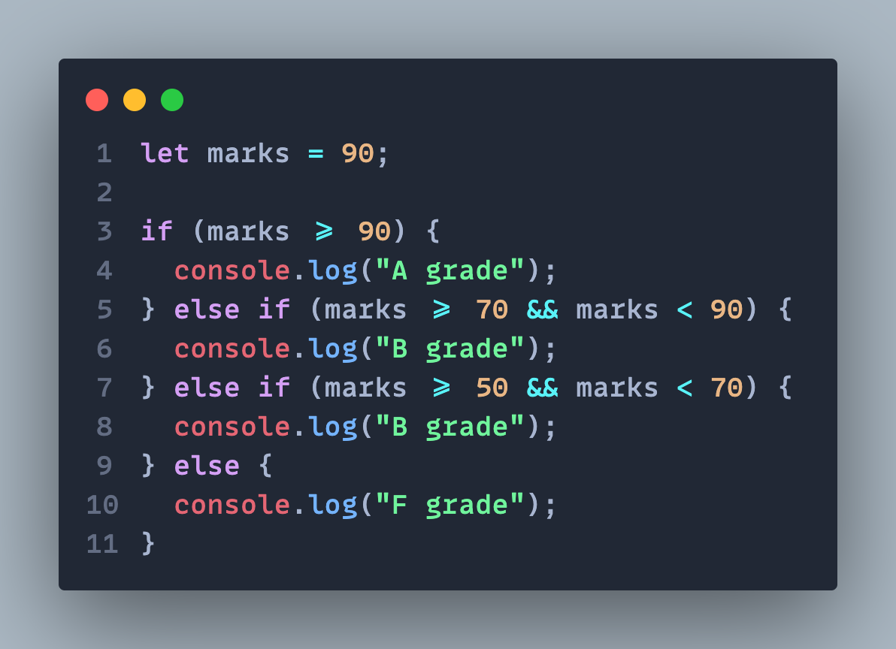
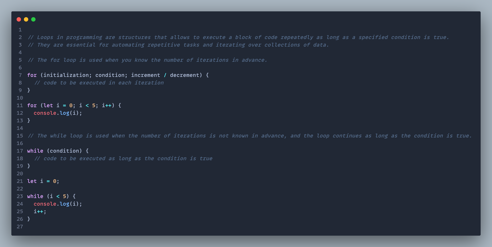
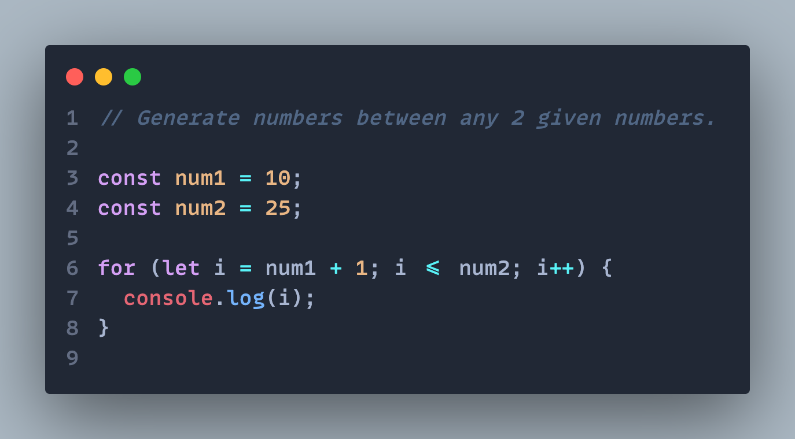
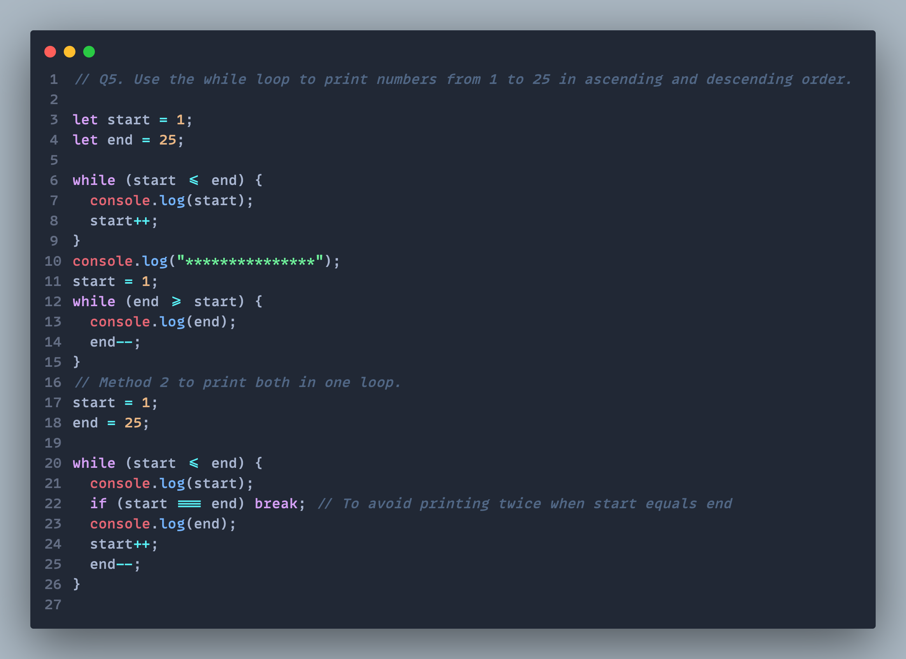

## Question 1: What are conditional statements? Explain conditional statements with syntax and examples.

## Question 2:. Write a program that grades students based on their marks.

## Question 3: What are loops, and what do we need them? Explain different types of loops with their syntax and examples.

<!-- |                 Normal screen                  |                  485px screen                  |
| :--------------------------------------------: | :--------------------------------------------: |
|  |  | -->

## Question 4: Generate numbers between any 2 given numbers.

## Question 5: Use the while loop to print numbers from 1 to 25 in ascending and descending order.

