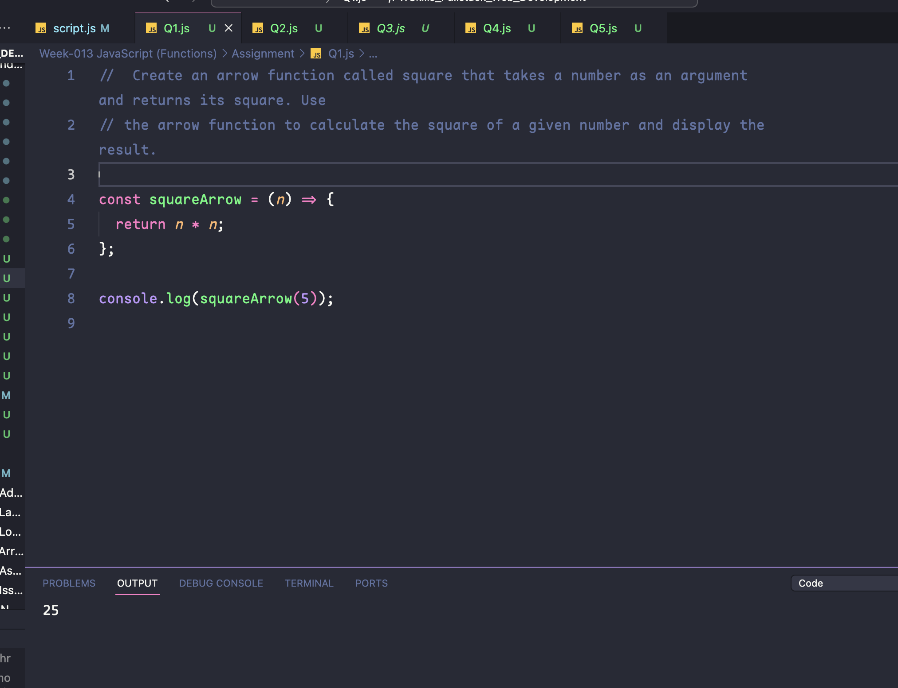
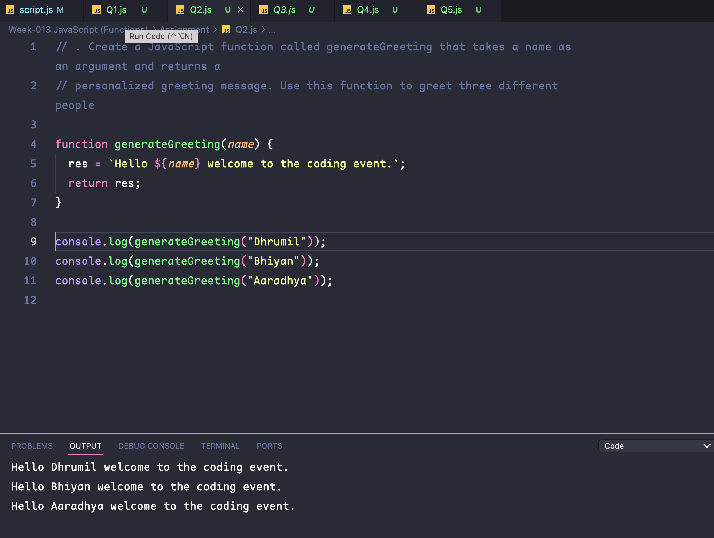
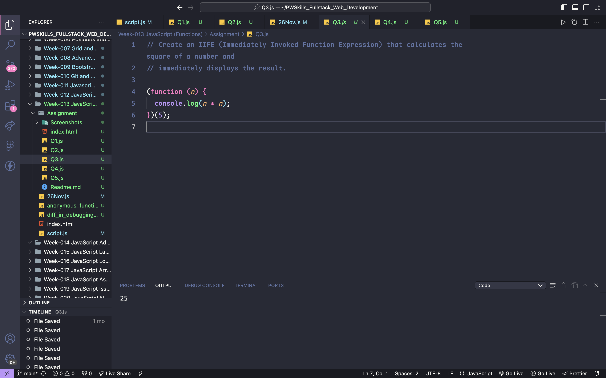
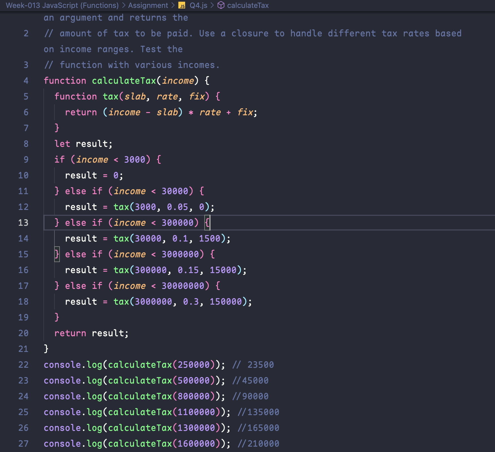
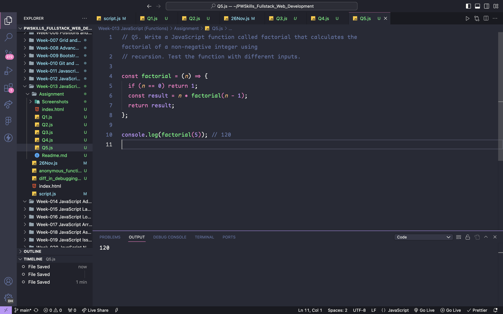
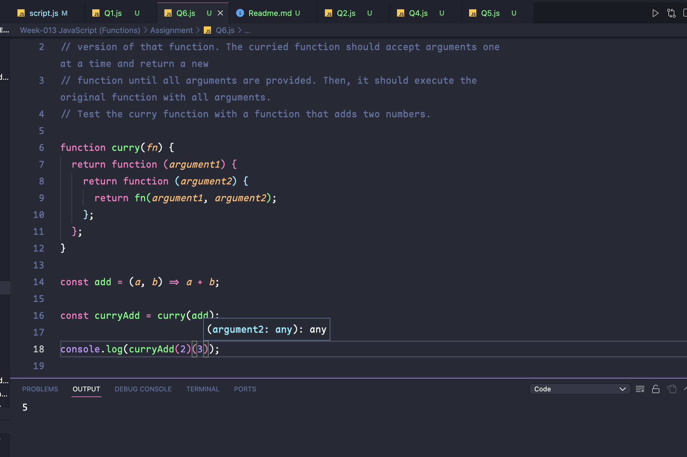

## Question 1: . Create an arrow function called square that takes a number as an argument and returns its square. Use the arrow function to calculate the square of a given number and display the result.

## Question 2:. Create a JavaScript function called generateGreeting that takes a name as an argument and returns a personalized greeting message. Use this function to greet three different people

## Question 3: Create an IIFE (Immediately Invoked Function Expression) that calculates the square of a number and immediately displays the result.

<!-- |                 Normal screen                  |                  485px screen                  |
| :--------------------------------------------: | :--------------------------------------------: |
|  |  | -->

## Question 4: Write a JavaScript function called calculateTax that takes an income as an argument and returns the amount of tax to be paid. Use a closure to handle different tax rates based on income ranges. Test the function with various incomes.

## Question 5:Write a JavaScript function called factorial that calculates the factorial of a non-negative integer using recursion. Test the function with different inputs.

## Question 6: Write a JavaScript function called curry that takes a function as an argument and returns a curried version of that function. The curried function should accept arguments one at a time and return a new function until all arguments are provided. Then, it should execute the original function with all arguments. Test the curry function with a function that adds two numbers.

